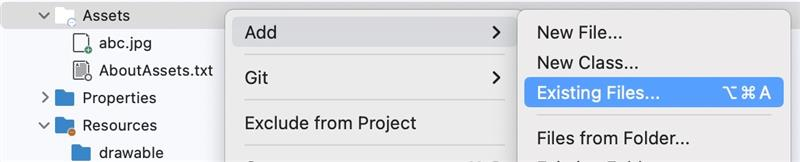

## How to add image assets in Xamarin.forms?

[<< Back to FAQ index](index.md)

### Add image assets in Xamarin.Android
#### 1. Add image to Assets 
 
#### 2. Set build action 
 

### Add image assets in Xamarin.iOS
[Learn how to display an image in Xamarin.iOS](https://learn.microsoft.com/en-us/xamarin/ios/app-fundamentals/images-icons/displaying-an-image?tabs=macos)
