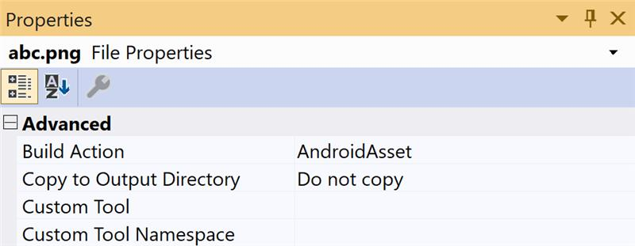
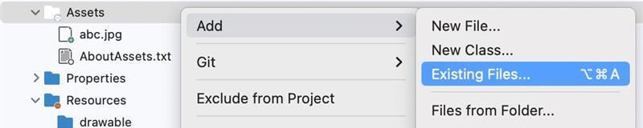

# How to add image assets in Xamarin.forms?

[<< Back to FAQ index](index.md)

## Add image assets in Xamarin.Android (Visual Studio 2022)

1. Add image to Assets

   

2. Set build action

   

## Add image assets in Xamarin.Android (Visual Studio 2022 for mac)

1. Add image to Assets

   

2. Set build action

   

## Add image assets in Xamarin.iOS

[Learn how to add an image in Xamarin.iOS](https://learn.microsoft.com/en-us/xamarin/ios/app-fundamentals/images-icons/displaying-an-image?tabs=macos)
