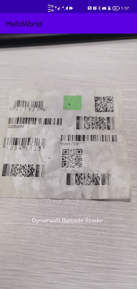

# Introduction to Dynamsoft Capture Vision

Dynamsoft Capture Vision (DCV) is an SDK designed for users to quickly embed barcode decoding, document scanning and label text recognizing features to a cross-platform application. A build-in camera view is available for users to capture and display the video streaming for image processing.

## Key Features

### Barcode Decoding

The barcode decoding feature of DCV is designed to be excellent on the performance and user-friendly on development. When working with DCV, users can easily deploy image or video barcode decoding functionality in cross-platform applications. Various processing parameters enable users to adjust performance on different usage scenarios. The following paragraphs will provide a brief overview on the barcode decoding feature.

#### Supported Barcode Symbologies

DCV supports all the common barcode symbologies which cover the majority of industries such as retail, commodity, drivers' license, etc. As for 1.0 version, the following barcode symbologies are supported:

| 1D/Linear Barcodes       | 2D Barcodes         | GS1 DataBar             | Postal Codes          | Other Types        |
|--------------------------|---------------------|-------------------------| --------------------- | ------------------ |
| Code 39/Code 39 Extended | QR Code             | Omnidirectional         | USPS Intelligent Mail | GS1 Composite Code |
| Code 93                  | Micro QR Code       | Truncated               | Postnet               | Patch Code         |
| Code 128                 | Data Matrix         | Stacked                 | Planet                | Pharmacode         |
| Codabar                  | PDF417              | Stacked Omnidirectional | Australian Post       |                    |
| Interleaved 2 of 5       | Micro PDF417        | Limited                 | UK Royal Mail         |                    |
| EAN-8                    | Aztec Code          | Expanded                |                       |                    |
| EAN-13                   | MaxiCode (mode 2-5) | Expanded Stacked        |                       |                    |
| UPC-A                    | DotCode             |                         |                       |                    |
| UPC-E                    |                     |                         |                       |                    |
| Industrial 2 of 5        |                     |                         |                       |                    |
| MSI (Modified Plessey)   |                     |                         |                       |                    |
| Code 11                  |                     |                         |                       |                    |

#### Performance

- Speed: DCV is able to scan 500+ barcodes per minutes.
- Read Rate: DCV can easily recognize the barcode even if they are curved, wrinkled, incompleted. The challenging environments like dark, shadowed or glaring can also be overcome.
- Accuracy: The decoded barcode results are evaluated and filtered before output. Users can add additional filter conditions to make the output result even more accurate.

#### Basic UI Interaction

When work with DCV, there are some build-in UI elements can help users to improve the interactivity of the barcode scanning applications. For example, user can easily highlight the decoded barcodes on the camera view.

   

   
Highlight Barcodes

<!--
### Document Scanning

DCV can detect quad areas such as the boundaries of document pages and tables from images, and perform document normalization on the images in the detected quads. The detectable areas include but are not limited to:

- Document pages
- Tables
- Cards like ID cards

The normalization process includes:

- Boundary cropping
- Deskew processing

   

   
Detect and Normalize the Documents

The following attributes of the output image can be adjusted:

- Colour mode
- Contrast
- Brightness

### Label Recognizing

The label recognizing feature of DCV is designed to extract text areas from an image and recognize the extracted characters. Different from the traditional OCR, DLR algorithm is specified on the symbolized text areas such as:

- Price tags
- Inventory labels
- VIN code
- Driver license
- Passport or Visa MRZ
- ID cards

Models, modes and templates are available to improve the recognition rate.
-->

## SDK Modules

- `DynamsoftCameraView`: The module that enable users to quickly deploy a camera view to capture and display the video streaming. Users can add basic UI elements on the view to improve the interactivity of the view.
- `DynamsoftBarcodeReader`: The module that supports barcode decoding feature. Users can specify barcode formats, control the start/stop of the barcode decoding thread, obtain barcode decoding results or upload advanced parameter controls via the module.

<!--
- `DynamsoftDocumentNormalizer`: The module that supports document scanning feature. The module includes the boundary detection algorithm and APIs that enable users to configure detection and normalization settings or upload advanced parameter settings.
- `DynamsoftLabelRecognizer`: The module that supports the label text recognition feature. When working with this module, users can improve the performance on localizating the text area or recognizing text by switching the recognition modes, modules and templates.

> Note:
>
> `DynamsoftDocumentNormalizer` and `DynamsoftLabelRecognizer` are not available in 1.0 version.
-->

## Scenarios

### Retail

The following feature of DCV can be applied to retail scenarios:

- Detect the labels on the commodities
- Quickly scan the barcodes on the labels
- Extract and parse the main content of the labels

### Driver's License Recognition

PDF417 symbology is used for storing personal information on US driver licenses. It comprises critical information about the cardholder, such as their name, gender, date of birth, height, etc. With the help of DCV barcode decoding feature, user can easily capture, recognize and parse the driver's information from the PDF417 barcode on mobile devices.

### VIN Scanning

DCV provides multiple solutions on recognizing Vehicle Identification Numbers (VINs). Generally when the VIN is accompanied with a barcode, barcode decoding feature is the highest solution on collecting the VIN data. When the VIN barcode is not available, user can still use the label recognition module to obtain the vehicle information.

## Supported Platforms

| Language | Platform |
| -------- | -------- |
|  React Native |  iOS /  Android |
|  Flutter |  iOS /  Android |
