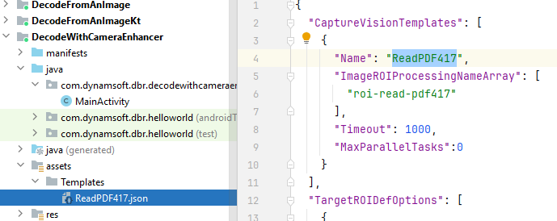

# Configure Settings

| Method | Description |
| ------ | ----------- |
| [`initSettings`](#initsettings) | Configures runtime settings using a provided JSON string, which contains settings for one or more `CaptureVisionTemplates`. |
| [`initSettingsFromFile`](#initsettingsfromfile) | Configures runtime settings using a provided JSON file, which contains settings for one or more `CaptureVisionTemplates`. |
| [`getSimplifiedSettings`](#getsimplifiedsettings) | Retrieves a simplified version of the Capture Vision settings for a specific template. |
| [`getTemplateNames`](#gettemplatenames) | Retrieves the names of all the currently available templates. |
| [`updateSettings`](#updatesettings) | Updates the specified `CaptureVisionTemplate` with an updated `SimplifiedCaptureVisionSettings` object. |
| [`resetSettings`](#resetsettings) | Restores all settings to their original default values. |
| [`outputSettings`](#outputsettings) | Returns an object that contains settings for the specified `CaptureVisionTemplate`. |
| [`outputSettingsToFile`](#outputsettingstofile) | Generates a JSON file download containing the settings for the specified `CaptureVisionTemplate`. |
| [`clearDLModelBuffers`](#cleardlmodelbuffers) | Clear the buffered deep learning models to release the memory. |
| [`setGlobalIntraOpNumThreads`](#setglobalintraopnumthreads) | Sets the global number of threads used internally for model execution. |

## initSettings

Configures runtime settings using a provided JSON string, which contains settings for one or more `CaptureVisionTemplates`.

```java
void initSettings(@NonNull String content) throws CaptureVisionRouterException;
```

**Parameters**

`[in] content`: A JSON string that contains Capture Vision settings.

**Exception**

| Error Code | Value | Description |
| :--------- | :---- | :---------- |
| EC_JSON_PARSE_FAILED | -10030 | Failed to parse the JSON data. |
| EC_JSON_TYPE_INVALID | -10031 | One or more parameters are allocated with wrong data type. |
| EC_JSON_KEY_INVALID | -10032 | There exists invalid key in your JSON data. |
| EC_JSON_VALUE_INVALID | -10033 | There exists invalid parameter value in your JSON data. |
| EC_JSON_NAME_KEY_MISSING | -10034 | One or more `name` parameters are missing in your JSON data. Each section of the JSON data requires a unique `name` parameter. |
| EC_JSON_NAME_VALUE_DUPLICATED | -10035 | There exists duplicated `name` parameters in your JSON data. The `name` parameter should be unique. |
| EC_JSON_NAME_REFERENCE_INVALID | -10037 | You have referenced an invalid `name` value in your JSON data. |
| EC_PARAMETER_VALUE_INVALID | -10038 | There exists invalid parameter value in your JSON data. |
| EC_CALL_REJECTED_WHEN_CAPTURING  | -10062 | Function call is rejected when capturing in progress. |

## initSettingsFromFile

Configures runtime settings using a provided JSON file, which contains settings for one or more `CaptureVisionTemplates`.

```java
void initSettingsFromFile(@NonNull String filePath) throws CaptureVisionRouterException;
```

**Parameters**

`[in] file`: A JSON file that contains Capture Vision settings.

**Exception**

| Error Code | Value | Description |
| :--------- | :---- | :---------- |
| EC_FILE_NOT_FOUND | -10005 | The file is not found. |
| EC_JSON_PARSE_FAILED | -10030 | Failed to parse the JSON data. |
| EC_JSON_TYPE_INVALID | -10031 | One or more parameters are allocated with wrong data type. |
| EC_JSON_KEY_INVALID | -10032 | There exists invalid key in your JSON data. |
| EC_JSON_VALUE_INVALID | -10033 | There exists invalid parameter value in your JSON data. |
| EC_JSON_NAME_KEY_MISSING | -10034 | One or more `name` parameters are missing in your JSON data. Each section of the JSON data requires a unique `name` parameter. |
| EC_JSON_NAME_VALUE_DUPLICATED | -10035 | There exists duplicated `name` parameters in your JSON data. The `name` parameter should be unique. |
| EC_JSON_NAME_REFERENCE_INVALID | -10037 | You have referenced an invalid `name` value in your JSON data. |
| EC_PARAMETER_VALUE_INVALID | -10038 | There exists invalid parameter value in your JSON data. |
| EC_CALL_REJECTED_WHEN_CAPTURING  | -10062 | Function call is rejected when capturing in progress. |

**Code Snippet**

Add a **Templates** folder to the assets folder of your project at **src\main\assets\Templates**. Put your JSON file in the **Templates** folder. Here we use a **ReadPDF417.json** file as an example.

<div align="left">
   <p></p>
   <p>Template Example</p>
</div>

Add the following code to initialize the template:

```java
try {
    mRouter.initSettingsFromFile("ReadPDF417.json");
} catch (CaptureVisionRouterException e) {
    throw new RuntimeException(e);
}
```

To use your template, you have to specify the template name in the `startCapturing` or `capture` method. The template name is the name of `CaptureVisionTemplates` in your template file (see in the image of step 3).

For example:

```java
mRouter.startCapturing("ReadPDF417", new CompletionListener() {
    @Override
    public void onSuccess() {
        // Add code to run when the capture is successfully started.
    }

    @Override
    public void onFailure(int errorCode, String errorString) {
        // Add code to run when the capture fails.
    }
});
```

## getSimplifiedSettings

Retrieves a simplified version of the Capture Vision settings for a specific template.

```java
SimplifiedCaptureVisionSettings getSimplifiedSettings(String templateName) throws CaptureVisionRouterException;
```

**Parameters**

`templateName`: Specify a template with a templateName for the data capturing.  

**Return Value**

An object of [`SimplifiedCaptureVisionSettings`](./auxiliary-classes/simplified-capture-vision-settings.md).

**Exception**

| Error Code | Value | Description |
| :--------- | :---- | :---------- |
| EC_TEMPLATE_NAME_INVALID | -10036 | The target template name is invalid. |
| EC_CONVERT_COMPLEX_TEMPLATE_ERROR | -10061 | The template you specified is a complex template which can not be output as a `SimplifiedCaptureVisionSettings` object. |
| EC_CALL_REJECTED_WHEN_CAPTURING  | -10062 | Function call is rejected when capturing in progress. |

## getTemplateNames

Retrieves the names of all the currently available templates.

```java
String[] getTemplateNames();
```

**Return Value**

An array that contains all the currently available templates names.

## updateSettings

Updates the specified `CaptureVisionTemplate` with an updated [`SimplifiedCaptureVisionSettings`](./auxiliary-classes/simplified-capture-vision-settings.md) object.

```java
void updateSettings(String templateName, SimplifiedCaptureVisionSettings settings) throws CaptureVisionRouterException;
```

**Parameters**

`[in] templateName`: Specify the name of the template that you want to update.

`[in] settings`: An object of `SimplifiedCaptureVisionSettings`.

**Exception**

| Error Code | Value | Description |
| :--------- | :---- | :---------- |
| EC_TEMPLATE_NAME_INVALID | -10036 | The target template name is invalid. |
| EC_PARAMETER_VALUE_INVALID | -10038 | There exists invalid parameter value in your `SimplifiedCaptureVisionSettings`. |
| EC_CONVERT_COMPLEX_TEMPLATE_ERROR | -10061 | The template you specified is a complex template which can not be updated via a `SimplifiedCaptureVisionSettings` object. |
| EC_CALL_REJECTED_WHEN_CAPTURING  | -10062 | Function call is rejected when capturing in progress. |

## resetSettings

Restores all settings to their original default values.

```java
void resetSettings() throws CaptureVisionRouterException;
```

**Exception**

| Error Code | Value | Description |
| :--------- | :---- | :---------- |
| EC_CALL_REJECTED_WHEN_CAPTURING  | -10062 | Function call is rejected when capturing in progress. |

## outputSettings

Returns an object that contains settings for the specified `CaptureVisionTemplate`.

```java
String outputSettings(String templateName, boolean includeDefaultValues) throws CaptureVisionRouterException;
```

**Parameters**

`[in] templateName`: The name of the template that you want to output.

`[in] includeDefaultValues`: A boolean value that indicates whether to include default values in the output.

**Return Value**

The Capture Vision settings in a JSON string.

**Exception**

| Error Code | Value | Description |
| :--------- | :---- | :---------- |
| EC_TEMPLATE_NAME_INVALID | -10036 | The target template name is invalid. |
| EC_CALL_REJECTED_WHEN_CAPTURING  | -10062 | Function call is rejected when capturing in progress. |

## outputSettingsToFile

Generates a JSON file download containing the settings for the specified `CaptureVisionTemplate`.

```java
void outputSettingsToFile(String templateName, @NonNull String filePath, boolean includeDefaultValues) throws CaptureVisionRouterException;
```

**Parameters**

`[in] templateName`: The name of the template that you want to output.

`[in] file`: The file path and name that you want to save the template.

`[in] includeDefaultValues`: A boolean value that indicates whether to include default values in the output.

**Exception**

| Error Code | Value | Description |
| :--------- | :---- | :---------- |
| EC_FILE_SAVE_FAILED | -10058 | The file path is unavailable or the file can't be created for any other reasons. |
| EC_CALL_REJECTED_WHEN_CAPTURING  | -10062 | Function call is rejected when capturing in progress. |

**Code Snippet**

```java
try {
    // To output the template to a JSON file, you have to get the read/write permission of the external storage first.
    // In this example, we output the template to the documents folder.
    String outputPath = String.valueOf(Environment.getExternalStoragePublicDirectory(Environment.DIRECTORY_DOCUMENTS));
    // Optional code. If you want to create a new folder under the documents folder, please uncomment the following code.
    // File file = new File(outputPath);
    // if(!file.exists()) {
    //     file.mkdirs();
    // }
    // You have to specify the template name and the file path. Here we use the preset template "PT_READ_BARCODES" as an example.
    mRouter.outputSettingsToFile(EnumPresetTemplate.PT_READ_BARCODES, outputPath+"/outputTemplate.json", false);
} catch (CaptureVisionRouterException e) {
    throw new RuntimeException(e);
}
```

## clearDLModelBuffers

Clear the buffered deep learning models to release the memory.

```java
static void clearDLModelBuffers();
```

**Remarks**

- Introduced in Dynamsoft Barcode Reader SDK version 11.2.1000 and Dynamsoft Capture Vision version 3.2.1000.

## setGlobalIntraOpNumThreads

Sets the global number of threads used internally for model execution.

```java
native static void setGlobalIntraOpNumThreads(int numThreads);
```

**Parameters**

`intraOpNumThreads`: Number of threads used internally for model execution. Valid range: [0, 256]. Default: 2.

**Remarks**

- Introduced in Dynamsoft Barcode Reader SDK version 11.2.1000 and Dynamsoft Capture Vision version 3.2.1000.
