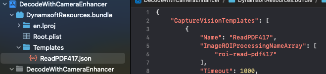

# Configure Settings

| Method | Description |
| ------ | ----------- |
| [`initSettings`](#initsettings) | Configures runtime settings using a provided JSON string, which contains settings for one or more `CaptureVisionTemplates`. |
| [`initSettingsFromFile`](#initsettingsfromfile) | Configures runtime settings using a provided JSON file, which contains settings for one or more `CaptureVisionTemplates`. |
| [`getSimplifiedSettings`](#getsimplifiedsettings) | Retrieves a `SimplifiedCaptureVisionSettings` object that contains simplified settings for the specified `CaptureVisionTemplate`. |
| [`getTemplateNames`](#gettemplatenames) | Retrieves the names of all the currently available templates. |
| [`updateSettings`](#updatesettings) | Updates the specified `CaptureVisionTemplate` with a `SimplifiedCaptureVisionSettings` object. |
| [`resetSettings`](#resetsettings) | Reset the Capture Vision settings. |
| [`outputSettings`](#outputsettings) | Returns an object that contains settings for the specified `CaptureVisionTemplate`. |
| [`outputSettingsToFile`](#outputsettingstofile) | Output the targeted Capture Vision settings to a JSON file. |
| [`clearDLModelBuffers`](#cleardlmodelbuffers) | Clear the buffered deep learning models to release the memory. |
| [`setGlobalIntraOpNumThreads`](#setglobalintraopnumthreads) | Sets the global number of threads used internally for model execution. |

## initSettings

Configures runtime settings using a provided JSON string, which contains settings for one or more `CaptureVisionTemplates`.

<div class="sample-code-prefix"></div>
>- Objective-C
>- Swift
>
>1. 
```objc
- (BOOL)initSettings:(NSString *)content
               error:(NSError * _Nullable * _Nullable)error
```
2. 
```swift
func initSettings(_ content:String) throws -> BOOL
```

**Parameters**

`content`: A JSON string that contains Capture Vision settings.  
`error`: An `NSError` pointer. If an error occurs, it will represent the error information.

**Error**

| Error Code | Value | Description |
| :--------- | :---- | :---------- |
| EC_JSON_PARSE_FAILED | -10030 | Failed to parse the JSON data. |
| EC_JSON_TYPE_INVALID | -10031 | One or more parameters are allocated with wrong data type. |
| EC_JSON_KEY_INVALID | -10032 | There exists invalid key in your JSON data. |
| EC_JSON_VALUE_INVALID | -10033 | There exists invalid parameter value in your JSON data. |
| EC_JSON_NAME_KEY_MISSING | -10034 | One or more `name` parameters are missing in your JSON data. Each section of the JSON data requires a unique `name` parameter. |
| EC_JSON_NAME_VALUE_DUPLICATED | -10035 | There exists duplicated `name` parameters in your JSON data. The `name` parameter should be unique. |
| EC_JSON_NAME_REFERENCE_INVALID | -10037 | You have referenced an invalid `name` value in your JSON data. |
| EC_PARAMETER_VALUE_INVALID | -10038 | There exists invalid parameter value in your JSON data. |
| EC_CALL_REJECTED_WHEN_CAPTURING  | -10062 | Function call is rejected when capturing in progress. |

**Return Value**

A BOOL value that indicates whether the settings are initialized successfully.

## initSettingsFromFile

Configures runtime settings using a provided JSON file, which contains settings for one or more `CaptureVisionTemplates`.

<div class="sample-code-prefix"></div>
>- Objective-C
>- Swift
>
>1. 
```objc
- (BOOL)initSettingsFromFile:(NSString *)file
                       error:(NSError * _Nullable * _Nullable)error
```
2. 
```swift
func initSettingsFromFile(_ file:String) throws -> BOOL
```

**Parameters**

`file`: A JSON file that contains Capture Vision settings.  
`error`: An `NSError` pointer. If an error occurs, it will represent the error information.

**Error**

| Error Code | Value | Description |
| :--------- | :---- | :---------- |
| EC_FILE_NOT_FOUND | -10005 | The file is not found. |
| EC_JSON_PARSE_FAILED | -10030 | Failed to parse the JSON data. |
| EC_JSON_TYPE_INVALID | -10031 | One or more parameters are allocated with wrong data type. |
| EC_JSON_KEY_INVALID | -10032 | There exists invalid key in your JSON data. |
| EC_JSON_VALUE_INVALID | -10033 | There exists invalid parameter value in your JSON data. |
| EC_JSON_NAME_KEY_MISSING | -10034 | One or more `name` parameters are missing in your JSON data. Each section of the JSON data requires a unique `name` parameter. |
| EC_JSON_NAME_VALUE_DUPLICATED | -10035 | There exists duplicated `name` parameters in your JSON data. The `name` parameter should be unique. |
| EC_JSON_NAME_REFERENCE_INVALID | -10037 | You have referenced an invalid `name` value in your JSON data. |
| EC_PARAMETER_VALUE_INVALID | -10038 | There exists invalid parameter value in your JSON data. |
| EC_CALL_REJECTED_WHEN_CAPTURING  | -10062 | Function call is rejected when capturing in progress. |

**Return Value**

A BOOL value that indicates whether the settings are initialized successfully.

**Code Snippet**

The following steps shows how to read a template file under the `DynamsoftResources.bundle`:

1. Create a **DynamsoftResources** folder in the finder. Under the **DynamsoftResources** folder create a new folder, **Templates**.

2. Put your **.json** template file under the **Templates** folder. Here we suppose you are adding a template file named **ReadPDF417.json**.

3. Rename the **DynamsoftResources** folder's extension name to **.bundle** and drag the **DynamsoftResources.bundle** into your project on Xcode. Select **Create groups** for the **Added folders** option.

   <div align="left">
      <p></p>
      <p>DynamsoftResources.bundle Example</p>
   </div>

4. Add the following code to your project to initialize the template:

   <div class="sample-code-prefix"></div>
   >- Objective-C
   >- Swift
   >
   >1. 
   ```objc
   [self.cvr initSettingsFromFile:@"ReadPDF417.json" error:nil];
   ```
   2. 
   ```swift
   try! cvr.initSettingsFromFile("ReadPDF417.json")
   ```

5. To use your template, you have to specify the template name in the `startCapturing` or `capture` method. The template name is the name of `CaptureVisionTemplates` in your template file (see in the image of step 3).

   <div class="sample-code-prefix"></div>
   >- Objective-C
   >- Swift
   >
   >1. 
   ```objc
   [self.cvr startCapturing:@"ReadPDF417" completionHandler:^(BOOL isSuccess, NSError * _Nullable error) {
      if (!isSuccess && error != nil) {
             // Add code to handle error
      }
   }];
   ```
   2. 
   ```swift
   cvr.startCapturing("ReadPDF417") { isSuccess, error in
      if (!isSuccess) {
             // Add code to handle error
      }
   }
   ```

## getSimplifiedSettings

Retrieves a `SimplifiedCaptureVisionSettings` object that contains simplified settings for the specified `CaptureVisionTemplate`.

<div class="sample-code-prefix"></div>
>- Objective-C
>- Swift
>
>1. 
```objc
- (nullable DSSimplifiedCaptureVisionSettings *)getSimplifiedSettings:(NSString *)templateName
                                                                error:(NSError * _Nullable * _Nullable)error;
```
2. 
```swift
func getSimplifiedSettings(_ templateName:String) throws -> SimplifiedCaptureVisionSettings
```

**Parameters**

`templateName`: Name of the targeted Capture Vision template that is defined in a JSON string or a JSON file.  
`error`: An `NSError` pointer. If an error occurs, it will represent the error information.

**Error**

| Error Code | Value | Description |
| :--------- | :---- | :---------- |
| EC_TEMPLATE_NAME_INVALID | -10036 | The target template name is invalid. |
| EC_CONVERT_COMPLEX_TEMPLATE_ERROR | -10061 | The template you specified is a complex template which can not be output as a `SimplifiedCaptureVisionSettings` object. |
| EC_CALL_REJECTED_WHEN_CAPTURING  | -10062 | Function call is rejected when capturing in progress. |

**Return Value**

A [`DSSimplifiedCaptureVisionSettings`](auxiliary-classes/simplified-capture-vision-settings.md) object.

**Remarks**

A single JSON string or file can define multiple Capture Vision templates. `getSimplifiedSettings` will only return the simplified settings of the template named in the input parameter, even though there could be several templates in the JSON string/file.

## getTemplateNames

Retrieves the names of all the currently available templates.

<div class="sample-code-prefix"></div>
>- Objective-C
>- Swift
>
>1. 
```objc
- (NSArray<NSString*>*) getTemplateNames;
```
2. 
```swift
func getSimplifiedSettings() -> SimplifiedCaptureVisionSettings
```

**Return Value**

An array that contains all the currently available templates names.

## updateSettings

Updates the specified `CaptureVisionTemplate` with a `SimplifiedCaptureVisionSettings` object.

<div class="sample-code-prefix"></div>
>- Objective-C
>- Swift
>
>1. 
```objc
- (BOOL)updateSettings:(NSString *)templateName
              settings:(nonnull DSSimplifiedCaptureVisionSettings *)settings
                 error:(NSError * _Nullable * _Nullable)error;
```
2. 
```swift
func updateSettings(_ templateName:String, settings:SimplifiedCaptureVisionSettings) throws -> BOOL
```

**Parameters**

`templateName`: Specifies a `CaptureVisionTemplate` by its name.  
`settings`: The [`SimplifiedCaptureVisionSettings`](auxiliary-classes/simplified-capture-vision-settings.md) object that contains updated settings.  
`error`: An `NSError` pointer. If an error occurs, it will represent the error information.

**Error**

| Error Code | Value | Description |
| :--------- | :---- | :---------- |
| EC_TEMPLATE_NAME_INVALID | -10036 | The target template name is invalid. |
| EC_PARAMETER_VALUE_INVALID | -10038 | There exists invalid parameter value in your `SimplifiedCaptureVisionSettings`. |
| EC_CALL_REJECTED_WHEN_CAPTURING  | -10062 | Function call is rejected when capturing in progress. |

**Return Value**

A bool value that indicates whether the settings are uploaded successfully.

## resetSettings

Restores all runtime settings to their original default values.

<div class="sample-code-prefix"></div>
>- Objective-C
>- Swift
>
>1. 
```objc
- (BOOL)resetSettings:(NSError * _Nullable * _Nullable)error;
```
2. 
```swift
func resetSettings() throws -> BOOL
```

**Parameters**

`error`: An `NSError` pointer. If an error occurs, it will represent the error information.

**Error**

| Error Code | Value | Description |
| :--------- | :---- | :---------- |
| EC_CALL_REJECTED_WHEN_CAPTURING  | -10062 | Function call is rejected when capturing in progress. |

**Return Value**

A BOOL value that indicates whether the settings are reset successfully.

## outputSettings

Returns an object that contains settings for the specified `CaptureVisionTemplate`.

<div class="sample-code-prefix"></div>
>- Objective-C
>- Swift
>
>1. 
```objc
- (nullable NSString *)outputSettings:(NSString *)templateName
                 includeDefaultValues:(BOOL)includeDefaultValues
                                error:(NSError * _Nullable * _Nullable)error
```
2. 
```swift
func outputSettings(_ templateName:String, includeDefaultValues:Bool) throws -> String
```

**Parameters**

`templateName`: The name of the template that you want to output.

`includeDefaultValues`: A bool value that indicates whether to include default values in the output.

`error`: An `NSError` pointer. If an error occurs, it will represent the error information.

**Error**

| Error Code | Value | Description |
| :--------- | :---- | :---------- |
| EC_TEMPLATE_NAME_INVALID | -10036 | The target template name is invalid. |
| EC_CALL_REJECTED_WHEN_CAPTURING  | -10062 | Function call is rejected when capturing in progress. |

**Return Value**

The Capture Vision settings in a JSON string.

## outputSettingsToFile

Output a JSON file containing the settings for the specified `CaptureVisionTemplate`.

<div class="sample-code-prefix"></div>
>- Objective-C
>- Swift
>
>1. 
```objc
- (BOOL)outputSettingsToFile:(NSString *)templateName
                        file:(NSString *)file
        includeDefaultValues:(BOOL)includeDefaultValues
                       error:(NSError * _Nullable * _Nullable)error;
```
2. 
```swift
func outputSettingsToFile(_ templateName:String, file:String, includeDefaultValues:Bool) throws -> BOOL
```

**Parameters**

`templateName`: The name of the template that you want to output.

`file`: The file path and name where the template will be output and saved.

`includeDefaultValues`: A bool value that indicates whether to include default values in the output.

`error`: An `NSError` pointer. If an error occurs, it will represent the error information.

**Error**

| Error Code | Value | Description |
| :--------- | :---- | :---------- |
| EC_FILE_SAVE_FAILED | -10058 | The file path is unavailable or the file can't be created for any other reasons. |
| EC_CALL_REJECTED_WHEN_CAPTURING  | -10062 | Function call is rejected when capturing in progress. |

**Return Value**

A BOOL value that indicates whether the template is output successfully.

## clearDLModelBuffers

Clear the buffered deep learning models to release the memory.

<div class="sample-code-prefix"></div>
>- Objective-C
>- Swift
>
>1. 
```objc
+(void)clearDLModelBuffers;
```
2. 
```swift
class func clearDLModelBuffers()
```

## setGlobalIntraOpNumThreads

Sets the global number of threads used internally for model execution.

<div class="sample-code-prefix"></div>
>- Objective-C
>- Swift
>
>1. 
```objc
+(void)setGlobalIntraOpNumThreads:(NSInteger)intraOpNumThreads;
```
2. 
```swift
class func setGlobalIntraOpNumThreads(_ intraOpNumThreads:Int)
```

**Parameters**

`intraOpNumThreads`: Number of threads used internally for model execution. Valid range: [0, 256]. Default: 2.
