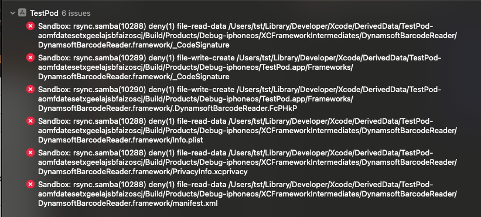

# How to deal with "Sandbox: rsync.sambe(10288)..." error

If you meet an error like this:

   

   
Sandboxing error

Find "User Script Sandboxing" setting in the **Build Settings/Build Options** of your project and change it to "No".
