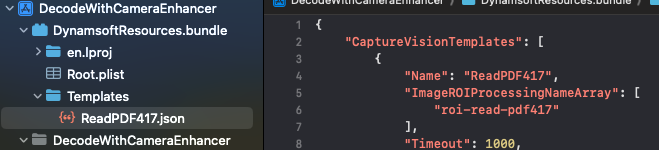

# Setup Resources

This page is the guide of how to setup resources for Dynamsoft Capture Vision iOS Edition.

1. Create a **DynamsoftResources** folder in the finder. Under the **DynamsoftResources** folder create a new folder and name it based on the type of your resource file.

   For example, if you want to setup a template file `ReadVIN.json`, you have to create a new folder named **Templates**. If you want to setup a model file `VINCharRecognition.data` and a template file `ReadVIN.json` at the same time, you have to create two new folders, **Models** and **Templates**.

   | Folder Name | Description |
   | ----------- | ----------- |
   | `Templates` | JSON files that define how to read barcode, scan mrz, etc. |
   | `Models` | Mainly are deep learning models that improves the barcode or text line read rate. |
   | `ConfusableChars` | Resource files for text line recognition. Help distinguish easily confused characters. "0", "O". It helps improving the character recognition accuracy. |
   | `Dictionaries` | The resource files used to assist in result validation. The recognition result can be corrected if it matches a word in the dictionary. |
   | `OverlappingChars` | The resource files used to validate or correct recognition results by overlaying standard characters with the recognized characters. |
   | `ParserResources` | The resource files that defines the content parsing rules. |

2. Put your resource file under the folder you just created.

3. Rename the **DynamsoftResources** folder's extension name to **.bundle** and drag the **DynamsoftResources.bundle** into your project on Xcode. Select **Create groups** for the **Added folders** option.

   <div align="left">
      <p></p>
      <p>DynamsoftResources.bundle Example</p>
   </div>

4. For the template files, here is an additional step. You have to use `initSettingsFromFile` to load your template file. Template file name should be specified as the `filePath` in the `initSettingsFromFile` method. For the other resource files, you don't need this step.

   <div class="sample-code-prefix"></div>
   >- Objective-C
   >- Swift
   >
   >1. 
   ```objc
   [self.cvr initSettingsFromFile:@"ReadPDF417.json" error:nil];
   ```
   2. 
   ```swift
   try! cvr.initSettingsFromFile("ReadPDF417.json")
   ```
