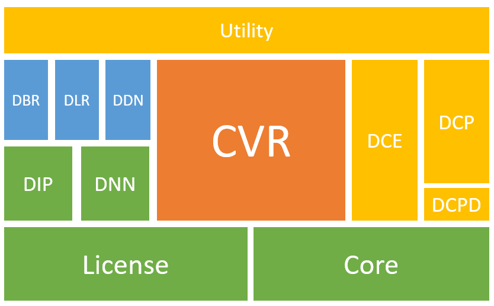

# SDK Overview: Modules and Main APIs

This page provides an overview of the various modules and highlights the most essential APIs that form the backbone of Dynamsoft Capture Vision SDKs.

## Modules Summary

**Dynamsoft.CaptureVisionBundle.Maui** is a bundle package that includes all libraries of Dynamsoft Capture Vision (DCV) architecture. The DCV libraries work together to achieve barcode reading, MRZ recognizing, document scanning and other image processing features. The hierarchical structure diagram below illustrates the various modules of the DCV SDKs (with modules at the top depending on those below).

    

    
Modules hierarchical of the DCV SDK

The table below describes details the functionalities of these modules:

| File | Description |
|:-----|:------------|
| `Dynamsoft.CaptureVisionRouter.Maui` | The Dynamsoft Capture Vision Router module is the cornerstone of the Dynamsoft Capture Vision (DCV) architecture. It focuses on coordinating batch image processing and provides APIs for setting up image sources and result receivers, configuring workflows with parameters, and controlling processes. |
| `Dynamsoft.BarcodeReader.Maui`(DBR) | The Dynamsoft Barcode Reader module recognizes and decodes multiple barcode formats such as QR codes, Code 39, Code 128, and Data Matrix, among many others. |
| `Dynamsoft.DocumentNormalizer.Maui`(DBR) | The Dynamsoft Document Normalizer module extracts structural information from document images, including document boundaries, shadow areas, and text areas. It uses this information to generate normalized document images through processes such as deskewing, shadow removal, and distortion correction. |
| `Dynamsoft.LabelRecognizer.Maui` (DLR) | The Dynamsoft Label Recognizer module identifies and recognizes text labels such as passport MRZs, ID cards, and VIN numbers. |
| `Dynamsoft.Core.Maui` | The Dynamsoft Core module lays the foundation for Dynamsoft SDKs based on the DCV (Dynamsoft Capture Vision) architecture. It encapsulates the basic classes, interfaces, and enumerations shared by these SDKs.|
| `Dynamsoft.ImageProcessing.Maui` | The Dynamsoft Image Processing module facilitates digital image processing and supports operations for other modules, including the Barcode Reader, Label Recognizer, and Document Normalizer.  |
| `Dynamsoft.NeuralNetwork.Maui` | The Dynamsoft Neural Network module allows SDKs compliant with the DCV (Dynamsoft Capture Vision) architecture to leverage the power of deep learning when processing digital images. |
| `Dynamsoft.License.Maui` | The Dynamsoft License module manages the licensing aspects of Dynamsoft SDKs based on the DCV (Dynamsoft Capture Vision) architecture. |
| `Dynamsoft.CameraEnhancer.Maui` | The Dynamsoft Camera Enhancer (DCE) module controls the camera, transforming it into an image source for the DCV (Dynamsoft Capture Vision) architecture through ISA implementation. It also enhances image quality during acquisition and provides basic viewers for user interaction. |
| `Dynamsoft.Utility.Maui` | The Dynamsoft Utility module defines auxiliary classes, including the ImageManager, and implementations of the CRF (Captured Result Filter) and ISA (Image Source Adapter). These are shared by all Dynamsoft SDKs based on the DCV (Dynamsoft Capture Vision) architecture. |
| `Dynamsoft.CodeParser.Maui` | The Dynamsoft Code Parser module converts data strings, typically encrypted in barcodes and machine-readable zones, into human-readable information. |
| `Dynamsoft.CodeParserDedicator.Maui` | The Dynamsoft Code Parser Dedicator module provides auxiliary functionality to enhance and extend the capabilities of DCP module. |

## Main APIs

### Capture Vision Router

The main class [`CaptureVisionRouter`]({{ site.dcv_maui_api }}capture-vision-router/capture-vision-router.html) acts as the SDK entry point and provides the following essential APIs:

- [Set input]({{ site.dcv_maui_api }}capture-vision-router/multiple-file-processing.html#setinput)
- [Config capture vision settings]({{ site.dcv_maui_api }}capture-vision-router/settings.html)
- [Add result receiver]({{ site.dcv_maui_api }}capture-vision-router/multiple-file-processing.html#addresultreceiver)
- [Start capturing]({{ site.dcv_maui_api }}capture-vision-router/multiple-file-processing.html#startcapturing)

### Image Source Adapter

The [`ImageSourceAdapter`]({{ site.dcv_maui_api }}core/image-source-adapter.html) class is an abstract class representing an adapter for image sources, providing a framework for fetching, buffering, and managing images from various sources. It serves as the input for the [`CaptureVisionRouter`]({{ site.dcv_maui_api }}capture-vision-router/capture-vision-router.html). You can either use the typical implementations of [`ImageSourceAdapter`]({{ site.dcv_maui_api }}core/image-source-adapter.html) or implement your own.

Class [`CameraEnhancer`]({{ site.dce_maui_api }}camera-enhancer.html) is one of the typical implementations of [`ImageSourceAdapter`]({{ site.dcv_maui_api }}core/image-source-adapter.html). It is a class that not only implements the video frame obtaining APIs but also enable you to improve the video quality by adjusting the camera settings.

### Captured Result Receiver

Implement the callback methods of [`CapturedResultReceiver`]({{ site.dcv_maui_api }}capture-vision-router/auxiliary-classes/captured-result-receiver.html) to receive the corresponding results you required. The callbacks are triggered when the processing of an image/vide frame is finished or timeout.

#### Barcode Decoding

Callback methods that are related to barcode decoding:

- [`OnDecodedBarcodesReceived`]({{ site.dcv_maui_api }}capture-vision-router/auxiliary-classes/captured-result-receiver.html#ondecodedbarcodesreceived): The callback of barcode decoding. The result you received in the callback method is a [`DecodedBarcodesResult`]({{ site.dbr_maui_api }}decoded-barcodes-result.html) object, which contains all the decoded barcodes from the processed image.

Related APIs:

- [`DecodedBarcodesResult`]({{ site.dbr_maui_api }}decoded-barcodes-result.html): All barcodes that decoded from the processed image.
- [`BarcodeResultItem`]({{ site.dbr_maui_api }}barcode-result-item.html): The barcode decoding result of a single barcode.

#### Document Scanning

Callback methods that are related to document scanning:

- [`OnDetectedQuadsReceived`]({{ site.dcv_maui_api }}capture-vision-router/auxiliary-classes/captured-result-receiver.html#ondetectedquadsreceived): The callback of document boundary detection. The result you received in the callback method is a [`DetectedQuadResult`]({{ site.ddn_maui_api }}detected-quads-result.html) object, which contains all the detected quads from the processed image.
- [`OnNormalizedImagesReceived`]({{ site.dcv_maui_api }}capture-vision-router/auxiliary-classes/captured-result-receiver.html#onnormalizedimagesreceived): The callback of image normalization. The result you received in the callback method is a [`NormalizedImagesResult`]({{ site.ddn_maui_api }}normalized-images-result.html) object, which contains all the normalized images from the processed image.

Related APIs:

- [`DetectedQuadResult`]({{ site.ddn_maui_api }}detected-quads-result.html): All quads that detected from the processed image.
- [`DetectedQuadResultItem`]({{ site.ddn_maui_api }}detected-quad-result-item.html): The boundary detection result of a single document page.
- [`NormalizedImagesResult`]({{ site.ddn_maui_api }}normalized-images-result.html): All normalized images that deskewed from the processed image.
- [`NormalizedImageResultItem`]({{ site.ddn_maui_api }}normalized-image-result-item.html): The deskewing result of a single document page.

#### MRZ Scanning

Callback methods that are related to MRZ scanning:

- [`OnParsedResultsReceived`]({{ site.dcv_maui_api }}capture-vision-router/auxiliary-classes/captured-result-receiver.html#onparsedresultsreceived): The callback of content parsing. The result you received in the callback method is a [`ParsedResult`]({{ site.dcp_maui_api }}parsed-result.html) object, which contains all the parsed results from the processed image.
- [`OnRecognizedTextLinesReceived`]({{ site.dcv_maui_api }}capture-vision-router/auxiliary-classes/captured-result-receiver.html#onrecognizedtextlinesreceived): The callback of text recognition. The result you received in the callback method is a [`RecognizedTextLinesResult`]({{ site.dlr_maui_api }}recognized-text-lines-result.html) object, which contains all the original MRZ text of the processed image.

Related APIs:

- [`ParsedResult`]({{ site.dcp_maui_api }}parsed-result.html): All parsed results that captured from the processed image.
- [`ParsedResultItem`]({{ site.dcp_maui_api }}parsed-result-item.html): The parsing result of a single parsable content.
- [`RecognizedTextLinesResult`]({{ site.dlr_maui_api }}recognized-text-lines-result.html): All text lines that recognized from the processed image.
- [`TextLineResultItem`]({{ site.dlr_maui_api }}text-line-result-item.html): The text recognition result of a single text line.

### Camera View

[`CameraView`]({{ site.dce_maui_api }}auxiliary-api/dcecameraview.html) is a view class that design for visualizing the real time video streaming and the barcode decoding result. If the [`CameraEnhancer`]({{ site.dce_maui_api }}camera-enhancer.html) is set as the input of your CVR, the decoded barcodes will be highlighted automatically on the [`CameraView`]({{ site.dce_maui_api }}auxiliary-api/dcecameraview.html).
